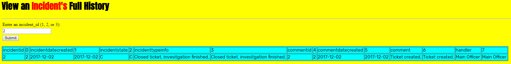

# Incident System

Track incidents and interface with your database through a webpage

## About

[*history.php*](src/php/history.php) is a webpage in which a user can enter an incident identification number and a history report for that incident is formatted and printed to the screen. Pressing submit completes the query and uses a view which has been granted select access to from www-data.

You can see the [tables](src/sql/tables.sql) and [sample data](src/sql/data.sql) in the database that the program queries the report from. You can also view the [schema](https://github.com/magarenzo/incident-system/blob/master/screenshots/scehma.PNG) for this project.

The PDF files in the [diagrams directory](https://github.com/magarenzo/incident-system/tree/master/diagrams) are based off of the given [case study](media/case-study.PNG), though the program does not fully represent what the system is entailed to be able to do.

The diagrams are as follows:

* [Use Case Diagram](media/UCD.pdf)

* [Data Flow Diagram](media/DFD.pdf)

* [Entity Relationship Diagram](media/ERD.pdf)

## Output

### Initial Homepage

### Submitted '2'

## TODO

* Fix loops to stop data from printing twice

* Add more interface options

## Dependency

[`psql`](https://help.ubuntu.com/lts/serverguide/postgresql.html)

## Owner

Michael A. Agarenzo

This was originally created as a final project in CSC443 (Database Management Systems) and it has undergone changes since then
